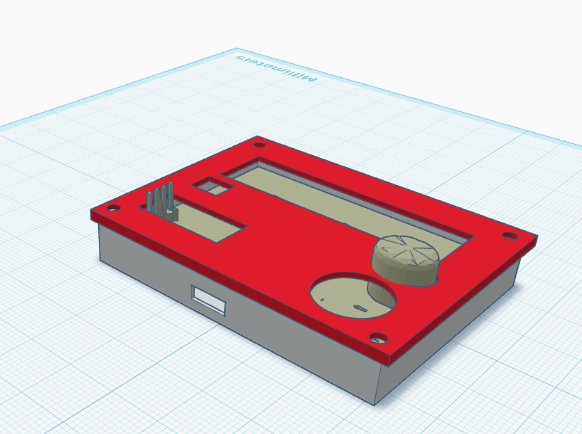
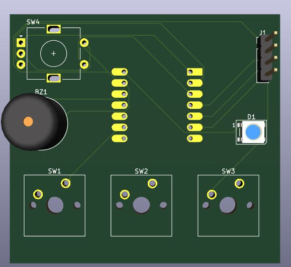

# hackpad-macropad :3

very kewl 3-key macropad made for hack club hackpad! 

it's a compact custom macropad featuring a rotary encoder, 0.91" OLED screen, WS2812B RGB LED, and a piezo buzzer for cool noises/audio feedback. everything is powered by the Seeed Studio XIAO RP2040 placed right at the top of the board!

## pics !!

### 3d case

### pcb layout

## features !!
* **Seeed XIAO RP2040:** mounted at the top of the PCB for clean USB-C access.
* **3x MX Switches:** mechanical key switches for your daily macros/shortcuts.
* **EC11 Rotary Encoder:** smooth knob control for volume, scrolling, or custom bindings (with built-in push button!).
* **0.91" I2C OLED Display:** 128x32 screen to show custom animations, status info, or graphics.
* **WS2812B RGB LED:** addressable Neopixel for custom lighting effects.
* **Piezo Buzzer:** self-supplied buzzer for playin chiptunes or audio feedback!

## repo structure

* `/PCB` - KiCad schematic (`.kicad_sch`), PCB layout (`.kicad_pcb`), and project files.
* `/CAD` - 3D model STEP files (`hackpad.step`).
* `/production` - Gerber files (`gerbers.zip`), 3D printable STL files (`Top.stl`, `Bottom.stl`), and production code.
* `/images` - Screenshots and 3D preview renders.
* `/Firmware` - CircuitPython code (`main.py`).

## CAD & case design
The enclosure consists of 2 custom 3D printed parts: `Top.stl` and `Bottom.stl`. Everything fits together neatly to protect the PCB and hold the mechanical switches firmly in place. Designed in CAD and exported to `/CAD/hackpad.step`.

## PCB design
Designed using KiCad! The layout puts the XIAO RP2040 at the top edge of the board to allow seamless USB cable plugging without hitting the case walls. All footprints and traces are verified with zero DRC errors.

## firmware overview
Runs using CircuitPython / MicroPython (`main.py`).
* Encoder controls audio/navigation.
* Switches trigger custom macros.
* OLED and RGB LED render real-time UI/feedback.

## stuff used (BOM)
Here's everything needed to build this hackpad:

- **1x** Seeed Studio XIAO RP2040
- **3x** Mechanical MX Switches
- **1x** EC11 Rotary Encoder
- **1x** 0.91" 128x32 I2C OLED Display
- **1x** WS2812B / Neopixel RGB LED
- **1x** Piezo Buzzer *(Self-supplied / extra part)*
- **1x** 3D Printed Top Case (`Top.stl`)
- **1x** 3D Printed Bottom Case (`Bottom.stl`)
